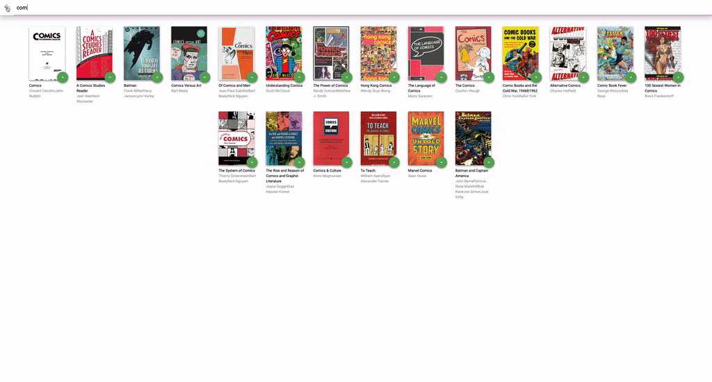

# MyReads

This Project user can arrange the books in three different shelf.
- Currently reading
- Want to read
- Read
User also can also saerch the book and add them to shelf.

##### Installation
- git clone https://github.com/Mayuresh12/BookShelf.git
- cd myreads
- npm install
- npm start

 ###### App Demo

## Tools used
- Visual Studio Code
- React.js
- Google Chrome
- Git
